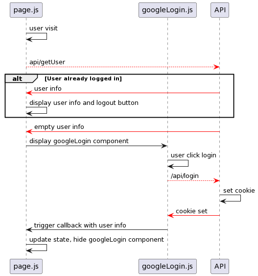
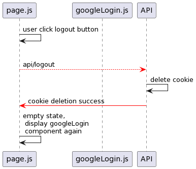
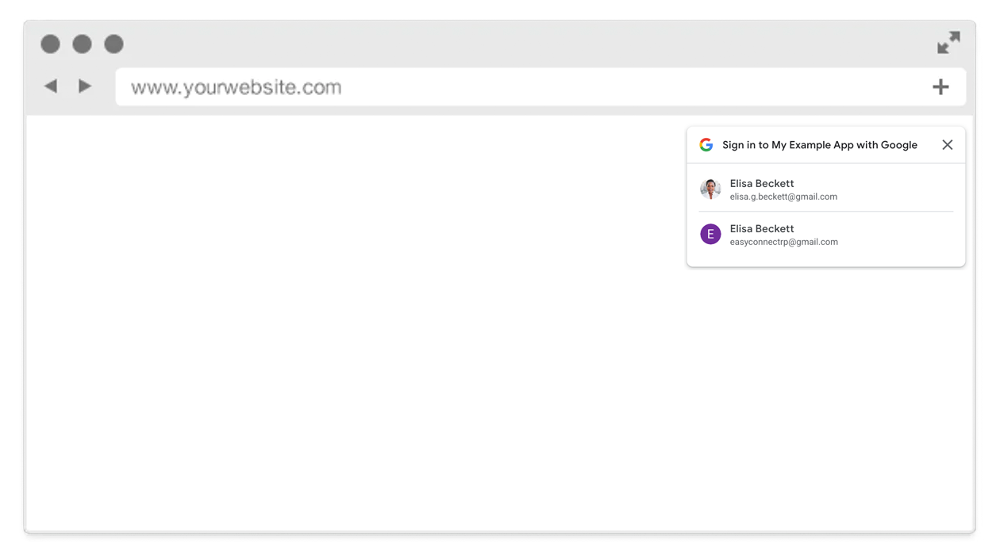

# react-google-one-tap-login in Next.js 13

This example demonstrates the use of `react-google-one-tap-login` package in a Next.js app using the new hooks and routing system of Next.js 13. The login and logout processes are depicted in two UML diagrams: `login-uml.png` and `logout-uml.png`. 

## Login Process

1. The user visits `/login/page.js`.
2. Upon mounting, `page.js` calls the `getUser` function.
3. `/api/getUser` checks for a cookie to verify the user's login status.
4. If the user is logged in, `/api/getUser` reads the user information from the database and returns it back to `page.js`.
5. `page.js` displays the user's information and a logout button.
6. If the user isn't logged in, `/api/getUser` sends an empty user response back to `page.js` and the login process triggers. It displays the `googleLogin` component along with a callback function to continue the login process.
7. `googleLogin.js` calls the `react-google-one-tap-login` hook which prompts a non-blocking UI for the user to log in with Google.
8. Clicking on the UI updates the state of the `googleLogin.js`.
9. `googleLogin.js` calls `/api/login` to set the cookie.
10. If the cookie is successfully set, `googleLogin.js` triggers a callback function passing the user information.
11. `page.js` updates its state with the user information, thus hiding the `googleLogin` component.

## Logout Process

1. The user clicks the logout button on `page.js`.
2. `page.js` makes a call to `/api/logout` to delete the cookie.
3. If the cookie is successfully deleted, `page.js` empties its current state, making the `googleLogin` component visible again.

# Usage
1. Add all the code from this repo to the `app` folder of your Next.js 13 project.
2. Replace `USE YOUR CLIENT ID` in `/login/googleLogin.js` with your actual client ID from Google API Console.
3. Start your Next.js app and visit `/login`.

What you should see if it's working:

